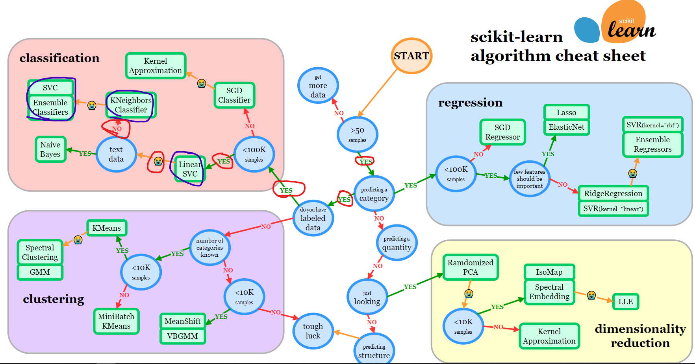

# A Jupyter Notebook file (.ipynb), with your code end to end

A PDF file (.pdf), with your reasoning and explanations on why you decided to do "A" and not "B" throughout your assignment.

## Common Models

## Preprocessing Pipelines

## Applying Machine Learning

### Benefits

#### CNNs

#### ML model 2

#### ML model 3

### Drawbacks

#### CNNs

#### ML model 2

#### ML model 3

## Spectogram CNN model

### First approach

### Extra Exploring

### Analysis

### Results

### Model Validation

### Impact on Decision Making
